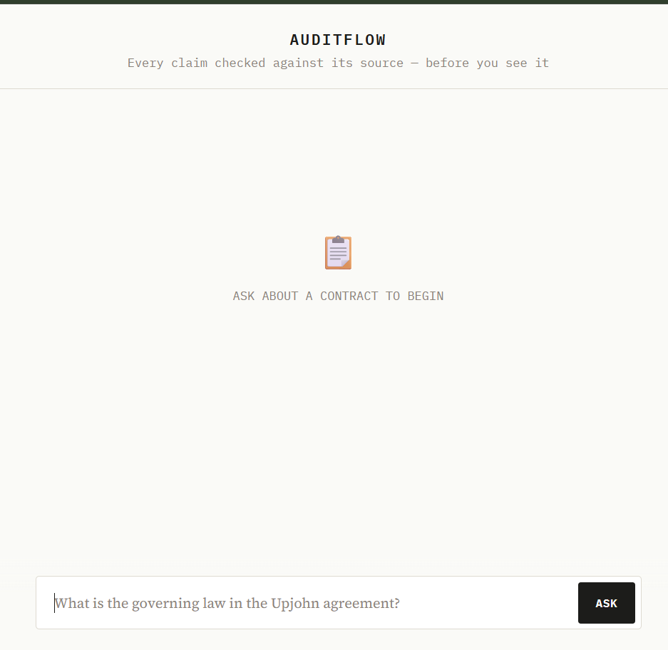
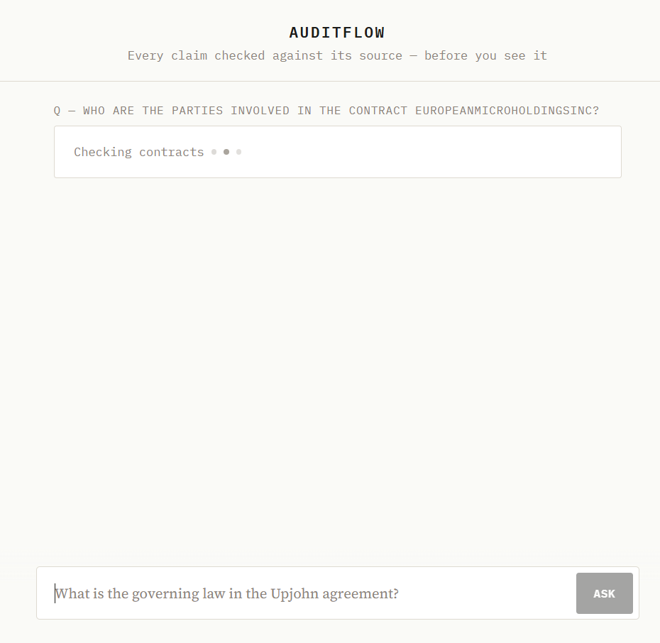
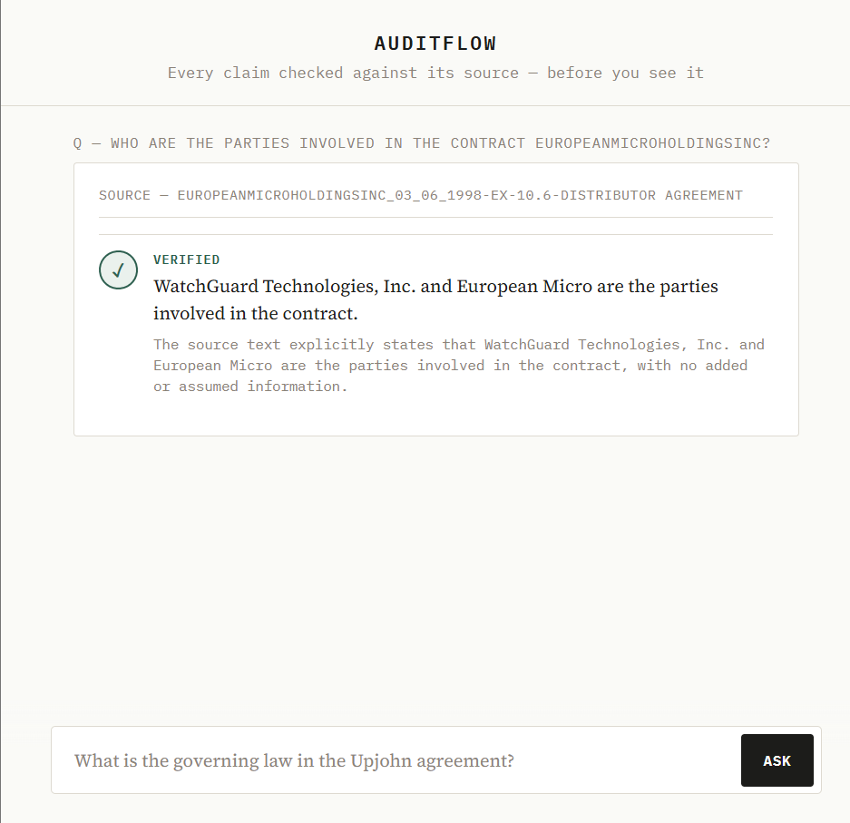
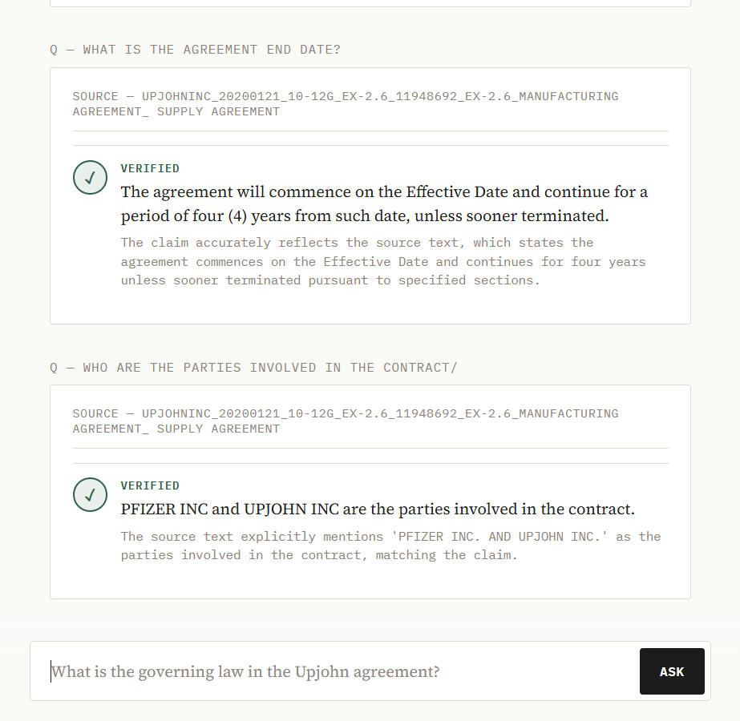
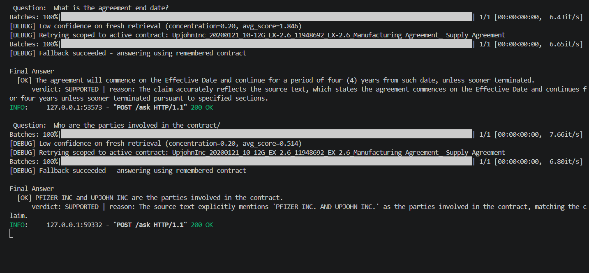

# AuditFlow

A verification-first RAG system for legal and financial contracts that checks every generated claim against its cited source before returning an answer.

## Problem

Standard RAG pipelines retrieve context, generate an answer, and return it without checking whether the generated text is actually supported by the retrieved source. In legal and financial documents, this is a meaningful risk: dropped conditions, misattributed clauses, or conflated terms across similar contracts can produce answers that read as confident and well-cited but are not accurate.

AuditFlow adds a verification stage that decomposes generated answers into atomic, source-tagged claims and checks each one against its cited chunk using a separate LLM-as-judge pass, before the answer is shown.

## Screenshots







## Architecture

```
Query
  │
  ▼
Hybrid Retrieval (BM25 + dense FAISS, fused via Reciprocal Rank Fusion)
  │
  ▼
Cross-Encoder Reranking (top 20 → top 5)
  │
  ▼
Document Consistency Check
  (concentration across contracts + average rerank score)
  │
  ├─ Low concentration  → request clarification (ambiguous across documents)
  ├─ Low average score  → decline (right document, content not relevant enough)
  └─ Confident          → proceed
        │
        ▼
  Generation (atomic, source-tagged claims, structured JSON output)
        │
        ▼
  Verification (claim vs. cited source chunk, judged independently)
        │
        ▼
  Answer with per-claim verdict: SUPPORTED / PARTIAL / UNSUPPORTED / NO_ANSWER
```

A session-level memory layer retries retrieval scoped to the previously-resolved contract when a follow-up question is too vague to resolve on its own, and detects when a question explicitly names a different contract to avoid incorrectly carrying over stale context (see Limitations).

If the first generation attempt finds no source for a claim, a single bounded retry is attempted with a rule-based query reformulation (e.g. mapping "effective date" → "dated as of") before falling back to a "not enough information" response. No additional LLM call is used for the reformulation step itself.

## Stack

- **Retrieval**: BM25 (`rank_bm25`) + dense embeddings (`BAAI/bge-large-en-v1.5`) via FAISS, fused with Reciprocal Rank Fusion
- **Reranking**: `cross-encoder/ms-marco-MiniLM-L-6-v2`
- **Generation**: Qwen2.5-7B-Instruct, served locally via Ollama (dev); Llama-3.1-8B via Groq (deployment path)
- **Verification (judge)**: Llama-3.3-70B via Groq API
- **Dataset**: [CUAD](https://www.atticusprojectai.org/cuad) (Contract Understanding Atticus Dataset), 15-contract subset
- **Backend**: FastAPI
- **Frontend**: HTML/CSS/JS, no framework

## Evaluation

A 65-question evaluation set was built from CUAD's lawyer-verified clause annotations, rephrased into natural-language questions, spanning 12 clause categories (Parties, Governing Law, Effective Date, Cap on Liability, etc.), including both answerable and intentionally unanswerable (`is_impossible=True`) cases.

Each result was manually labeled against the ground-truth clause text.

| Metric | Result |
|---|---|
| Hallucination rate (among answered questions) | 1/6 = 16.7% |
| Correct decline rate (on unanswerable/ambiguous questions) | 24/25 = 96.0% |
| Questions resulting in a generated answer | 6/65 (9.2%) |
| Questions correctly declined (clarification or low-relevance) | 59/65 (90.8%) |

The system is precision-oriented by design: it declines to answer roughly 90% of the time on this eval set, in exchange for a low error rate on the answers it does produce. This is a deliberate tradeoff for a legal-document use case, where an incorrect answer is more costly than a request for clarification.

## Known limitations

- **Contract names mentioned inside a query do not, by themselves, guarantee correct retrieval.** A rule-based check detects when a question names a contract different from the one currently in session memory and re-scopes retrieval accordingly; however, this match is based on name fragments and prefixes, not true fuzzy matching, so unusual abbreviations or misspellings of a contract name may not be detected.
- **The conversational memory fallback assumes a vague follow-up continues the previous topic** unless a different contract is explicitly detected in the text. This is a deliberate, bounded heuristic rather than true intent classification.
- **Verification confirms faithfulness to the cited source, not relevance to the question.** A claim can be verified as fully supported by its source chunk while the chunk itself does not address what was asked. This was observed in evaluation (see `eval/eval_results.json`, "Minimum Commitment" category).
- **A subset of CUAD's ground-truth answers contain redacted placeholder values** (e.g. a bullet character, or a partial date such as "200_") rather than real values, reflecting redactions in the original SEC filings. The system correctly retrieves and cites these placeholders as-is; there is no real value to find in the source text for these fields.
- **The system does not resolve internal cross-references.** A clause defining a term by reference (e.g. "the Effective Date means the date first written above") may be cited verbatim rather than resolved to the actual value elsewhere in the document. A generation-prompt rule and a preamble-chunk-inclusion heuristic mitigate this for common cases (dates, parties) but do not eliminate it generally.
- **Out-of-scope questions** (e.g., general company information not present in the contract text) are correctly identified as unanswerable, but are not distinguished in the UI from genuinely ambiguous retrieval failures.

## Running locally

```bash
# 1. Install dependencies
pip install -r requirements.txt

# 2. Pull the local generation model
ollama pull qwen2.5:7b-instruct

# 3. Set environment variables (.env)
GROQ_API_KEY=your_key_here

# 4. Build the index (first run only)
python src/splitter.py
python src/embedding.py

# 5. Start the backend
uvicorn Backend.main:app --reload --port 8000

# 6. Serve the frontend
cd frontend && python -m http.server 5500
```

## Project structure

```
verirag/
├── Backend/        FastAPI app exposing the pipeline as an API
├── data/           Raw CUAD data and processed FAISS index
├── eval/           Evaluation set, results, and scoring
├── frontend/       Static HTML/CSS/JS client
└── src/            Retrieval, generation, verification pipeline
```