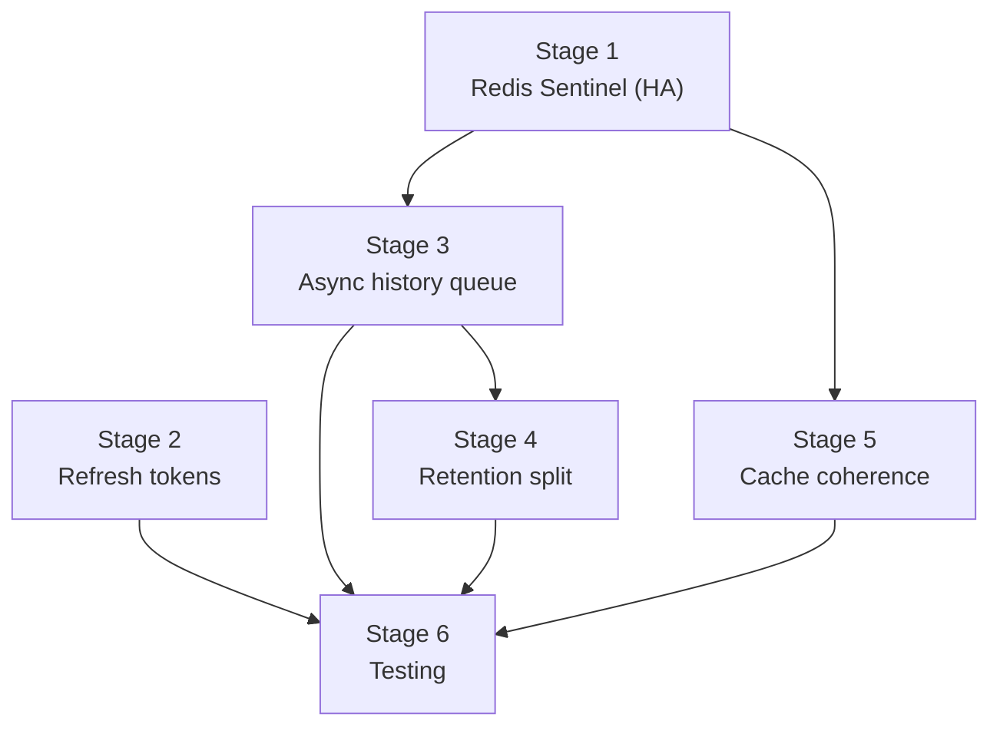
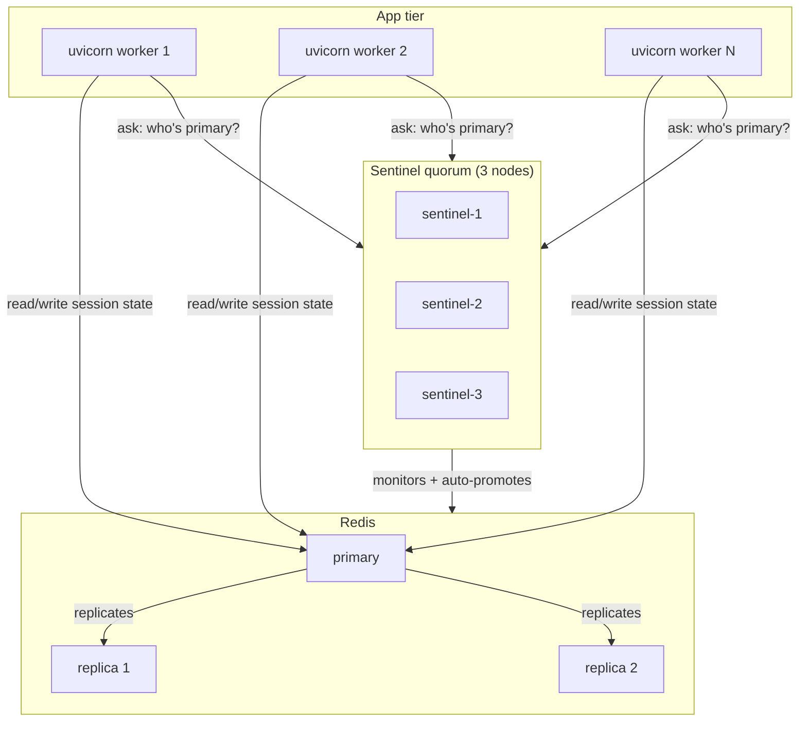
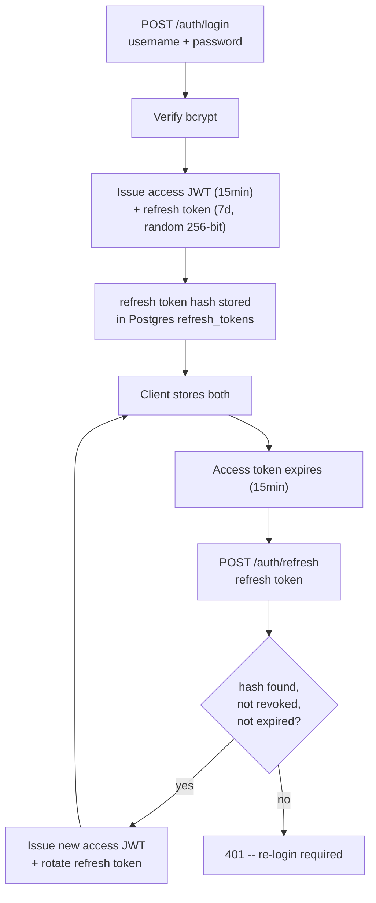
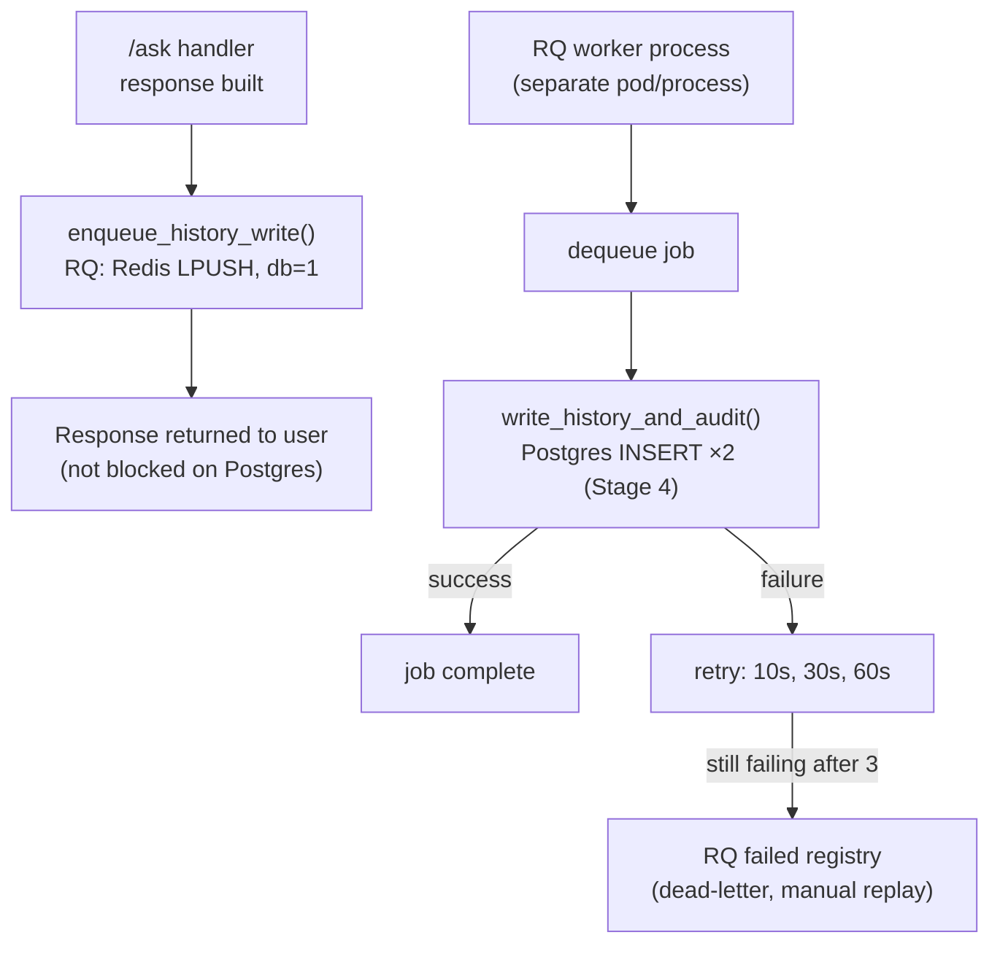
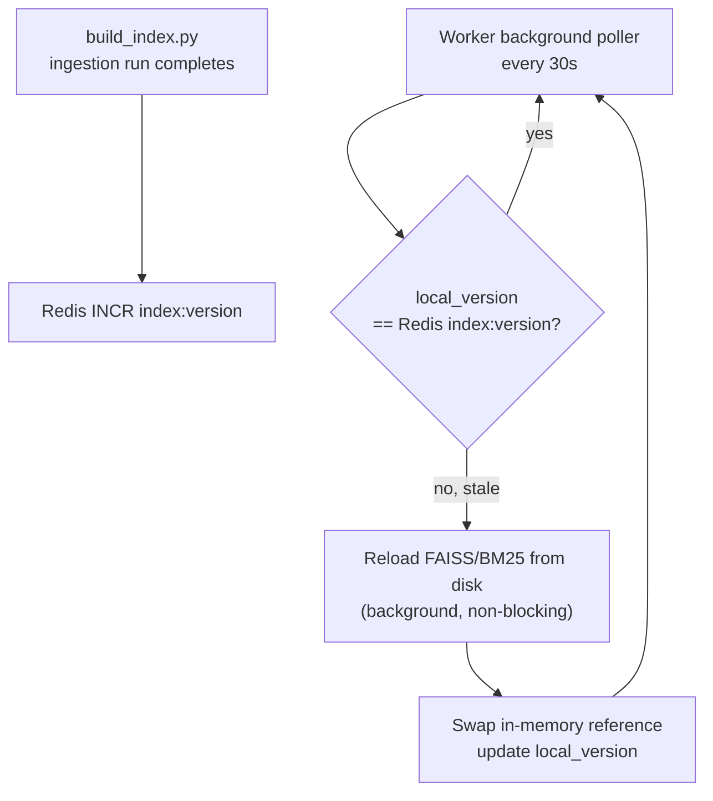
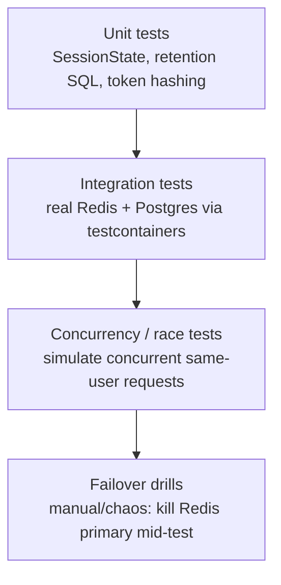

# AuditFlow — Phase 2 Architecture: HA, Auth, Async History, Cache Coherence, Testing

This supersedes the "explicitly left open" table (§6) in
`ARCHITECTURE_sessions_and_history.md`. Items 1, 2, 3, 4, and 5 from
that table are addressed below, each as its own stage with its own
schema, code, and rollout unit. Item 9 (testing) is addressed as Stage
6. Items 6, 7, 8 (CORS, PII/encryption, ELK/Kibana) remain **explicitly
deferred** — security work to be scoped separately, per your call.

Stages are ordered by dependency, not by importance — build in this
order, but nothing stops you from parallelizing 3, 4, and 5 once Stage 1
lands, since they don't depend on each other.

---

## Stage 0 — Dependency map



Stage 1 is the true prerequisite — Stages 3 and 5 both reuse the same
Redis, and building them against a single non-HA instance means
re-testing them against Sentinel later. Stage 2 (auth) is independent
of the rest and can be built in parallel. Stage 6 threads through
everything since each stage needs its own tests, but the concurrency
tests that motivated this whole effort specifically need Stage 1 and
Stage 3 done first.

---

## Stage 1 — Redis High Availability (Sentinel)

### Problem

A single Redis instance is a SPOF for session state: if it goes down,
every `/ask` request fails, for every user, at once. Given the scale
(100 employees, one premises deployment) and that this is a stateful
dependency now sitting on the critical path, Sentinel — not Cluster,
which solves sharding, a problem you don't have — is the right fit.

### Topology



3 Sentinel nodes is the minimum for quorum-based failure detection (2
must agree the primary is down before promoting a replica — avoids a
single flaky network link triggering a false failover). 1 primary + 2
replicas is standard; more replicas buys nothing at this data volume
(session blobs are kilobytes).

### Design decisions, and why

- **`redis-py`'s built-in `Sentinel` client**, not a hand-rolled
  primary-discovery mechanism — it already handles "ask Sentinel who's
  primary, connect there, retry on failover" correctly and is what the
  ecosystem tests against.
- **Fail-closed 503 stays**, even with Sentinel. Failover isn't
  instantaneous — there's a window (typically single-digit seconds)
  between the primary dying and a replica being promoted. During that
  window, requests should still fail loudly rather than hang or
  silently use stale/no state. Sentinel reduces the *duration* of the
  SPOF window from "however long it takes a human to notice and
  restart Redis" to "a few seconds," it doesn't eliminate the window.
- **Separate logical Redis DB indices for session state vs. the Stage 3
  queue.** Same physical Sentinel-managed cluster, `db=0` for sessions,
  `db=1` for the RQ queue (Stage 3) — keeps `FLUSHDB`/monitoring/memory
  policy decisions independent without running two separate clusters.

### Implementation

```python
# src/auditflow/orchestration/redis_client.py
"""
Single place that resolves 'the current Redis primary' via Sentinel.
Both session_store.py (db=0) and the Stage 3 queue (db=1) import from
here rather than constructing their own connections.
"""
import os
from redis.sentinel import Sentinel

SENTINEL_HOSTS = [
    (h.split(":")[0], int(h.split(":")[1]))
    for h in os.environ["SENTINEL_HOSTS"].split(",")  # e.g. "sentinel-1:26379,sentinel-2:26379,sentinel-3:26379"
]
SERVICE_NAME = os.environ.get("REDIS_SERVICE_NAME", "auditflow-redis")

_sentinel = Sentinel(SENTINEL_HOSTS, socket_timeout=0.5)


def get_primary(db: int = 0):
    """Resolved fresh on each call -- redis-py's Sentinel client caches
    the primary address internally and re-resolves automatically on a
    connection error, so this is cheap to call per-request."""
    return _sentinel.master_for(SERVICE_NAME, socket_timeout=0.5, db=db)


def get_replica(db: int = 0):
    """For read-only lookups where slightly stale data is acceptable --
    not used by session_store today (session reads must be fresh), but
    available for future read-heavy, staleness-tolerant use cases."""
    return _sentinel.slave_for(SERVICE_NAME, socket_timeout=0.5, db=db)
```

```python
# session_store.py -- constructor changes, interface (get/set/locked/
# push_recent_turn) is untouched, so pipeline.py needs zero changes
from src.auditflow.orchestration.redis_client import get_primary

class SessionStore:
    def __init__(self):
        self._r = get_primary(db=0)
    ...
```

```python
# main.py -- fail-closed wrapper around the Redis-dependent block
from redis.exceptions import ConnectionError as RedisConnectionError

@app.post("/ask", response_model=AskResponse)
def ask_endpoint(payload: Question, user: CurrentUser = Depends(require_permission("ask", "execute"))) -> AskResponse:
    try:
        with session_store.locked(user.username):
            state = session_store.get(user.username)
            response = pipeline.ask(payload.question, state)
            session_store.set(user.username, state, user.role)
        session_store.push_recent_turn(user.username, payload.question, response.status, response.document_id)
    except (RedisConnectionError, TimeoutError):
        logger.error("Session store unavailable for user=%s", user.username)
        raise HTTPException(status_code=503, detail="Session service temporarily unavailable, please retry")

    enqueue_history_write(user.username, payload.question, response)  # Stage 3
    return response
```

### Infra

```yaml
# docker-compose.yml -- illustrative single-host topology; in a real
# multi-node deployment each of these runs on a separate host/pod
redis-primary:
  image: redis:7-alpine
  command: redis-server --maxmemory 256mb --maxmemory-policy allkeys-lru

redis-replica-1:
  image: redis:7-alpine
  command: redis-server --replicaof redis-primary 6379

redis-replica-2:
  image: redis:7-alpine
  command: redis-server --replicaof redis-primary 6379

sentinel-1:
  image: redis:7-alpine
  command: redis-sentinel /etc/sentinel.conf
  volumes: ["./sentinel.conf:/etc/sentinel.conf"]
# sentinel-2, sentinel-3: identical pattern
```

```conf
# sentinel.conf (same file on all 3 sentinel nodes)
sentinel monitor auditflow-redis redis-primary 6379 2   # "2" = quorum
sentinel down-after-milliseconds auditflow-redis 5000
sentinel failover-timeout auditflow-redis 10000
sentinel parallel-syncs auditflow-redis 1
```

---

## Stage 2 — Refresh Tokens & Revocation

### Problem

`/auth/login` issues one 8h JWT with no way to revoke it early and no
way to renew it without a full re-login. Named accounts + a real
90-day-retained audit trail (Stage 4) makes "can we cut off this
person's access right now" a real operational requirement, not
theoretical.

### Flow



### Design decisions, and why

- **Access token TTL drops from 8h to 15 min.** Short-lived access
  tokens limit the blast radius of a leaked token to minutes, not
  hours — the refresh token is what makes this not annoying for users.
- **Refresh tokens stored hashed (SHA-256), never plaintext**, same
  principle as password storage — a Postgres breach shouldn't hand out
  usable tokens.
- **Rotation on every refresh**: each `/auth/refresh` call issues a
  *new* refresh token and immediately revokes the old one (`revoked_at
  = now()`), rather than reusing the same refresh token for 7 days.
  This means a stolen-and-replayed old refresh token becomes detectable
  — if it's ever presented after rotation, that's a signal of theft
  (worth logging/alerting on, not just silently rejecting).
- **Revocation is now real**, not just "wait for natural expiry" — a
  deactivated account's outstanding refresh token gets `revoked_at` set
  by an admin action, and since access tokens are now 15 min instead of
  8h, the account is fully locked out within 15 minutes at most, not up
  to 8 hours.

### Schema

```sql
CREATE TABLE IF NOT EXISTS refresh_tokens (
    id BIGSERIAL PRIMARY KEY,
    username TEXT NOT NULL,
    token_hash TEXT NOT NULL UNIQUE,
    issued_at TIMESTAMPTZ NOT NULL DEFAULT now(),
    expires_at TIMESTAMPTZ NOT NULL,
    revoked_at TIMESTAMPTZ
);

CREATE INDEX idx_refresh_tokens_hash ON refresh_tokens (token_hash) WHERE revoked_at IS NULL;
CREATE INDEX idx_refresh_tokens_username ON refresh_tokens (username);
```

### Implementation

```python
# src/auditflow/auth/refresh.py
import hashlib
import secrets
from datetime import datetime, timedelta, timezone

from src.auditflow.ingest.store import document_store

ACCESS_TOKEN_TTL = timedelta(minutes=15)
REFRESH_TOKEN_TTL = timedelta(days=7)


def _hash(token: str) -> str:
    return hashlib.sha256(token.encode()).hexdigest()


def issue_refresh_token(username: str) -> str:
    raw = secrets.token_urlsafe(32)
    document_store.execute(
        "INSERT INTO refresh_tokens (username, token_hash, expires_at) VALUES (%s, %s, %s)",
        (username, _hash(raw), datetime.now(timezone.utc) + REFRESH_TOKEN_TTL),
    )
    return raw


def rotate_refresh_token(raw_token: str) -> tuple[str, str] | None:
    """Returns (username, new_raw_token) if valid, else None. Atomically
    revokes the old token and issues a new one in one transaction so a
    concurrent double-use can't both succeed."""
    token_hash = _hash(raw_token)
    with document_store.transaction() as tx:
        row = tx.fetch_one(
            "SELECT username, expires_at FROM refresh_tokens "
            "WHERE token_hash = %s AND revoked_at IS NULL FOR UPDATE",
            (token_hash,),
        )
        if row is None or row["expires_at"] < datetime.now(timezone.utc):
            return None
        tx.execute("UPDATE refresh_tokens SET revoked_at = now() WHERE token_hash = %s", (token_hash,))
        new_raw = secrets.token_urlsafe(32)
        tx.execute(
            "INSERT INTO refresh_tokens (username, token_hash, expires_at) VALUES (%s, %s, %s)",
            (row["username"], _hash(new_raw), datetime.now(timezone.utc) + REFRESH_TOKEN_TTL),
        )
        return row["username"], new_raw


def revoke_all_for_user(username: str) -> None:
    """Called on logout, or by an admin deactivating an account."""
    document_store.execute(
        "UPDATE refresh_tokens SET revoked_at = now() WHERE username = %s AND revoked_at IS NULL",
        (username,),
    )
```

```python
# src/auditflow/auth/routes.py -- additions
@router.post("/auth/refresh")
def refresh(body: RefreshRequest) -> TokenResponse:
    result = rotate_refresh_token(body.refresh_token)
    if result is None:
        raise HTTPException(status_code=401, detail="Invalid or expired refresh token")
    username, new_refresh = result
    role = document_store.get_user_role(username)
    access_token = issue_access_jwt(username, role, ttl=ACCESS_TOKEN_TTL)
    return TokenResponse(access_token=access_token, refresh_token=new_refresh)


@router.post("/auth/logout")
def logout(user: CurrentUser = Depends(require_permission("ask", "execute"))) -> dict:
    revoke_all_for_user(user.username)
    session_store.clear(user.username)  # also drop live session state, per earlier design
    return {"status": "logged out"}
```

`/auth/login` changes to call `issue_refresh_token` alongside the
existing JWT issuance and return both in the response body.

---

## Stage 3 — Async History Pipeline (Queue + Worker)

### Problem

`record_turn()` currently runs inline in the request path — a Postgres
insert adds latency to every `/ask` call, and if that insert fails
(transient Postgres blip), you either lose the history row silently or
have to decide whether to fail the whole request over a non-critical
write.

### Design decisions, and why

- **RQ (Redis Queue), backed by the same Sentinel-managed Redis from
  Stage 1, logical `db=1`.** Not Celery — Celery's feature set (complex
  routing, multiple broker backends, scheduled tasks) is more than this
  needs; RQ is a thin, well-understood layer over Redis lists, and you
  already have HA Redis from Stage 1, so it introduces zero new
  infrastructure. Not a Postgres-native queue (`SELECT ... FOR UPDATE
  SKIP LOCKED`) either — that would work, but couples the queue's
  availability to Postgres and adds polling overhead; Redis is already
  the faster, already-HA option sitting right there.
- **Producer just enqueues, doesn't wait.** `enqueue_history_write()` in
  the request path is a Redis `LPUSH`-speed operation, not a Postgres
  round-trip — the user gets their answer without waiting on history
  persistence at all.
- **Worker retries with backoff, then dead-letters.** A transient
  Postgres failure shouldn't lose the row — RQ's built-in retry
  (`Retry(max=3, interval=[10, 30, 60])`) handles that. If it still
  fails after 3 attempts, the job moves to RQ's **failed job registry**
  (its dead-letter queue) rather than vanishing — an admin/ops process
  can inspect and manually replay failed jobs.
- **Worker runs as a separate process/pod**, not inside the `uvicorn`
  process — so a burst of history-writing doesn't compete with request
  handling for the same event loop/threadpool, and you can scale
  workers independently of API replicas.

### Flow



### Implementation

```python
# src/auditflow/orchestration/history_queue.py
from redis import Redis
from rq import Queue, Retry

from src.auditflow.orchestration.redis_client import get_primary

_queue_redis: Redis = get_primary(db=1)
history_queue = Queue("history-writes", connection=_queue_redis)


def enqueue_history_write(username: str, question: str, response) -> None:
    history_queue.enqueue(
        "src.auditflow.orchestration.history_worker.write_history_and_audit",
        username, question, response.status, response.document_id, response.claims_summary(),
        retry=Retry(max=3, interval=[10, 30, 60]),
    )
```

```python
# src/auditflow/orchestration/history_worker.py
"""
Runs inside `rq worker history-writes`, a separate process. Does the
actual Postgres write(s) -- see Stage 4 for why this writes to TWO
tables, not one.
"""
from src.auditflow.ingest.store import document_store


def write_history_and_audit(username, question, status, document_id, claims_summary) -> None:
    with document_store.transaction() as tx:
        tx.execute(
            "INSERT INTO conversation_turns (username, question, response_status, document_id, claims_summary) "
            "VALUES (%s, %s, %s, %s, %s)",
            (username, question, status, document_id, claims_summary),
        )
        tx.execute(
            "INSERT INTO audit_log (username, question, response_status, document_id, claims_summary) "
            "VALUES (%s, %s, %s, %s, %s)",
            (username, question, status, document_id, claims_summary),
        )
```

```bash
# worker deployment -- separate process/pod from uvicorn
rq worker history-writes --url redis://<sentinel-resolved-primary>:6379/1
```

(In a real Sentinel setup, the worker also needs Sentinel-aware
connection resolution rather than a fixed URL — use the same
`get_primary(db=1)` helper from Stage 1 rather than a raw `--url`.)

---

## Stage 4 — Retention Split: `conversation_turns` vs `audit_log`

### Problem / requirement (as you specified)

User-facing history (what `/history` shows an employee about their own
activity) should be deleted per a retention window **for every role,
including employee/ceo/admin** — not just viewer. But a **separate,
immutable audit trail must survive 90 days regardless of role**, for
compliance/admin visibility, independent of whatever the user-facing
retention window is.

### Design decisions, and why

- **Two tables, written together (Stage 3's worker inserts into both in
  one transaction), deleted on separate schedules.** This is the
  cleanest way to give "user-facing history" and "compliance record" #
  independent lifecycles without one job's deletion logic needing to
  know about the other's rules.
- **`conversation_turns`** — what `/history` and `/history/all` read
  from. Subject to **role-based retention**, deleted for everyone
  eventually.
- **`audit_log`** — never read by the `/history` endpoints at all;
  reserved for a future admin-only compliance view (out of scope here,
  but the table exists now so 90-day history isn't lost while that view
  gets built). Fixed 90-day retention, same for every role.
- **Retention periods are defaults below, not final** — you said you'll
  decide role-based specifics; these are reasonable starting points
  that you can tune by changing only the `DELETE ... WHERE role = ...`
  values, no code change.

  | Role | `conversation_turns` retention | `audit_log` retention |
  |---|---|---|
  | viewer | 7 days | 90 days |
  | employee | 30 days | 90 days |
  | ceo | 30 days | 90 days |
  | admin | 30 days | 90 days |

### Schema

```sql
CREATE TABLE IF NOT EXISTS audit_log (
    id BIGSERIAL PRIMARY KEY,
    username TEXT NOT NULL,
    question TEXT NOT NULL,
    response_status TEXT NOT NULL,
    document_id TEXT,
    claims_summary JSONB,
    created_at TIMESTAMPTZ NOT NULL DEFAULT now()
);

CREATE INDEX idx_audit_log_username_created ON audit_log (username, created_at DESC);
CREATE INDEX idx_audit_log_created ON audit_log (created_at);  -- for the retention job's WHERE clause
```

(`conversation_turns` schema unchanged from the previous document.)

### Retention jobs (scheduled — cron / APScheduler, run daily)

```sql
-- conversation_turns: role-based, applies to everyone now
DELETE FROM conversation_turns ct
USING users u
WHERE ct.username = u.username
  AND (
    (u.role = 'viewer'   AND ct.created_at < now() - INTERVAL '7 days')
    OR (u.role IN ('employee', 'ceo', 'admin') AND ct.created_at < now() - INTERVAL '30 days')
  );

-- audit_log: fixed 90 days, same for every role, no join needed
DELETE FROM audit_log WHERE created_at < now() - INTERVAL '90 days';
```

Two separate `DELETE` statements, run by the same daily job or two
independent jobs — either is fine since they touch different tables and
have no ordering dependency.

---

## Stage 5 — Cache Coherence Across Workers (FAISS/BM25)

### Problem

Carried forward from the original ARCHITECTURE.md's known limitation
#3: FAISS/BM25 are loaded into memory once at process startup.
`build_index.py` (run when documents are added/changed) writes new
index files to disk, but a *running* `uvicorn` process never notices —
`retrieve.invalidate_cache()` exists but nothing calls it. This was
low-priority for a single process; it becomes a correctness problem the
moment you're running multiple workers/replicas (which HA Redis in
Stage 1 makes more likely, since session-sharing across workers is now
solved) — some workers would serve stale index data indefinitely after
an ingestion run, with no way to tell which ones.

### Design decisions, and why

- **Version counter in Redis, not Pub/Sub.** Pub/Sub messages are
  fire-and-forget — a worker that's mid-restart, or a new pod that
  scales up *after* the invalidation message was published, simply
  misses it and never learns the index is stale. A version counter
  (`INCR`ed once per successful ingestion run) is state, not an event —
  any worker, regardless of when it checks, sees the same authoritative
  "current version" and can compare it to what it has loaded.
- **Each worker polls the version on a lightweight interval**, not on
  every single retrieval call — checking a Redis key before every `/ask`
  adds a round-trip to the hot path for something that changes rarely
  (only when documents are ingested). A 30-second background poll is
  cheap and catches staleness fast enough for this use case.
- **Reload happens in a background task, not blocking requests.** When a
  worker detects its local version is behind, it reloads FAISS/BM25
  from disk in the background and only swaps the in-memory reference
  over once the new load completes — in-flight requests keep using the
  old (still-valid, just slightly stale) index rather than blocking or
  erroring during the reload.

### Flow



### Implementation

```python
# src/auditflow/ingest/build_index.py -- add at the end, after a
# successful write of FAISS/BM25/Postgres
from src.auditflow.orchestration.redis_client import get_primary

def _bump_index_version() -> None:
    get_primary(db=0).incr("index:version")

# call _bump_index_version() as the last line of a successful build_index run
```

```python
# src/auditflow/retrieval/cache_watcher.py
"""
Runs inside each uvicorn worker via FastAPI's lifespan. Polls the
shared version counter and triggers retrieve.invalidate_cache() +
reload when this process's loaded index is behind.
"""
import asyncio
from src.auditflow.orchestration.redis_client import get_primary
from src.auditflow.retrieval import retrieve
from core.logging_config import logger

POLL_INTERVAL_SECONDS = 30


async def watch_index_version():
    r = get_primary(db=0)
    local_version = int(r.get("index:version") or 0)
    retrieve.set_loaded_version(local_version)  # baseline at startup

    while True:
        await asyncio.sleep(POLL_INTERVAL_SECONDS)
        try:
            current = int(r.get("index:version") or 0)
        except Exception:
            continue  # Redis blip -- keep serving the currently-loaded index, try again next cycle
        if current != local_version:
            logger.info("Index version changed (%d -> %d), reloading", local_version, current)
            await asyncio.to_thread(retrieve.reload_index_from_disk)  # loads new FAISS/BM25 off the event loop
            retrieve.invalidate_cache()
            local_version = current
            retrieve.set_loaded_version(local_version)
```

```python
# main.py -- lifespan addition (alongside Stage-independent cleanup tasks)
@asynccontextmanager
async def lifespan(app: FastAPI):
    watcher_task = asyncio.create_task(watch_index_version())
    yield
    watcher_task.cancel()
```

`retrieve.reload_index_from_disk()` and `retrieve.set_loaded_version()`
are new small functions needed in `retrieve.py` — `reload_index_from_disk`
does what `build_index.py`'s initial load already does (read the FAISS
file, rebuild the BM25 corpus dict) but callable at runtime; the actual
in-memory swap should happen atomically (build the new objects fully,
then reassign the module-level references in one step) so a request
never sees a half-loaded index.

---

## Stage 6 — Testing Architecture

### Problem

None of the above (locking, failover, queue retries, cache
invalidation) is trustworthy without tests that actually exercise
concurrency and failure paths — the original bug this whole effort
started from was exactly this kind of race, and it wouldn't have been
caught by a happy-path unit test.

### Test pyramid



Weight effort toward the bottom of this pyramid inversely — fewer,
higher-value tests as you go up; the concurrency and failover tests are
the ones that actually validate the reason this phase exists.

### What goes where

- **Unit tests** (no external services, fast, run on every commit):
  - `SessionState.to_json`/`from_json` round-trips.
  - `_looks_like_contract_selection`, `_mentions_different_contract` —
    pure functions, already easy to test in isolation.
  - `pending_candidates` validation logic in `_resolve_pending_selection`
    (reject an unlisted document_id, accept a listed one).
  - Token hashing (`_hash` is deterministic, easy to assert).

- **Integration tests** (`testcontainers-python` spins up real Redis +
  Postgres in Docker for the test run — not `fakeredis`/sqlite mocks,
  since the whole point is validating real lock/transaction behavior
  that in-memory fakes don't faithfully reproduce):
  - `SessionStore.get/set/locked` against a real Redis container.
  - `refresh_tokens` rotation — issue, refresh, confirm old hash is
    revoked, confirm reuse of the old raw token now fails.
  - RQ job actually reaching Postgres — enqueue a job against a real
    Redis + RQ worker (run inline via `Worker(..., burst=True)` for
    tests), assert the row lands in both `conversation_turns` and
    `audit_log`.
  - Retention `DELETE` statements — seed rows at various ages/roles,
    run the job, assert exactly the expected rows are gone.

- **Concurrency / race tests** — the category most directly validating
  this whole phase's reason for existing:
  ```python
  def test_concurrent_requests_same_user_dont_corrupt_state():
      """Fire N concurrent /ask calls for the SAME user and assert the
      lock actually serialized them -- no lost updates to active_contract."""
      import concurrent.futures
      with concurrent.futures.ThreadPoolExecutor(max_workers=10) as ex:
          futures = [ex.submit(client.post, "/ask", json={"question": f"q{i}"}, headers=auth_headers)
                     for i in range(10)]
          results = [f.result() for f in futures]
      assert all(r.status_code == 200 for r in results)
      # assert session_store.get(username) ends in a internally-consistent
      # state, not a half-applied interleaving of two requests

  def test_different_users_dont_leak_pending_question():
      """User A gets a clarification prompt; User B's unrelated next
      message must NOT be treated as A's answer."""
      ...
  ```
  This second test is, concretely, a regression test for the exact bug
  that started this whole conversation — it should have existed from
  the beginning and is worth writing even before the rest of Stage 6.

- **Failover drills** — harder to automate fully, start manual:
  during a load test against the Sentinel topology, kill the Redis
  primary container mid-run and confirm (a) Sentinel promotes a
  replica within the configured `failover-timeout`, (b) in-flight
  requests during the gap get a clean 503 (Stage 1's fail-closed
  handling), not a hang or 500, (c) requests succeed again
  automatically once failover completes, no restart of the app needed.
  Worth scripting with `docker compose kill redis-primary` +ass a load
  generator, even if it's not part of the automated CI suite yet.

### CI pipeline shape

```yaml
# illustrative -- adapt to your actual CI system
stages:
  - unit          # every commit, no services, seconds
  - integration   # every PR, testcontainers spin-up, ~minutes
  - concurrency   # every PR, same containers, targeted race tests
  # failover drills: manual/scheduled, not blocking on every PR
```

---

## Rollout summary

| Stage | Depends on | New infra | Blocking for production? |
|---|---|---|---|
| 1 — Redis Sentinel | — | 3× Sentinel + 2 Redis replicas | Yes — current design is a SPOF without it |
| 2 — Refresh tokens | — | `refresh_tokens` table | Yes — named accounts with 8h unrevocable tokens is a real gap |
| 3 — Async history queue | Stage 1 | RQ worker process/pod | Should precede Stage 4 (worker writes both tables) |
| 4 — Retention split | Stage 3 | `audit_log` table | Needed once real employee data starts accumulating |
| 5 — Cache coherence | Stage 1 | none (uses existing Redis) | Yes, once you run more than one worker/replica |
| 6 — Testing | all above | testcontainers in CI | Ongoing, but the concurrency test should exist before Stage 1 ships |

**Still explicitly out of scope, per your instruction**: CORS
hardening, PII/encryption-at-rest decisions on stored questions, and
ELK/Kibana-based operational logging. These remain open and will be
scoped separately when you're ready.